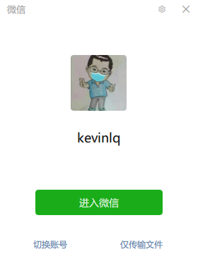
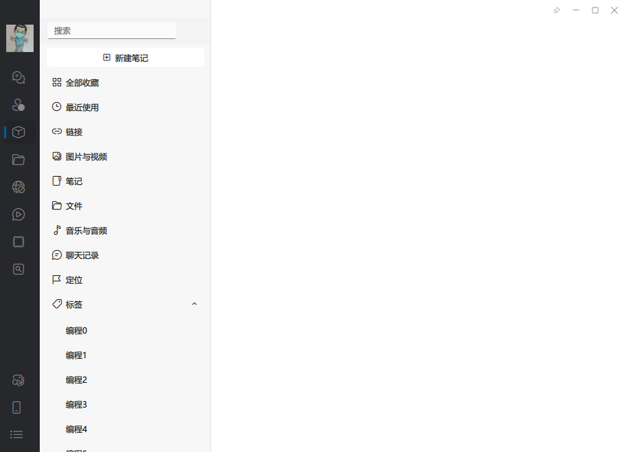
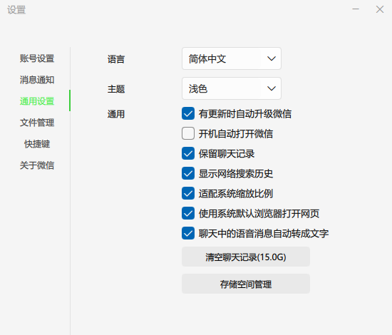
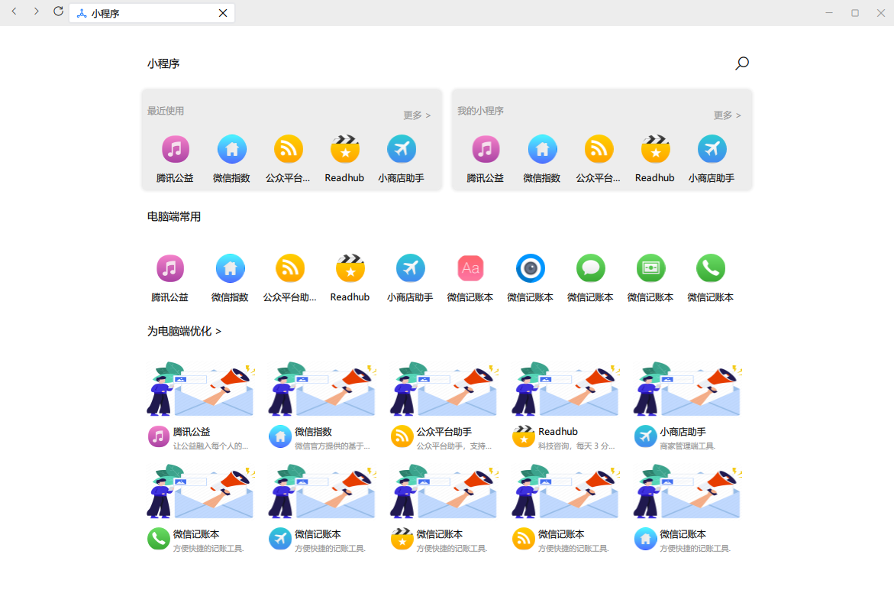

<!-- PROJECT SHIELDS -->
<!--
*** I'm using markdown "reference style" links for readability.
*** Reference links are enclosed in brackets [ ] instead of parentheses ( ).
*** See the bottom of this document for the declaration of the reference variables
*** for contributors-url, forks-url, etc. This is an optional, concise syntax you may use.
*** https://www.markdownguide.org/basic-syntax/#reference-style-links
-->
[![Contributors][contributors-shield]][contributors-url]
[![Forks][forks-shield]][forks-url]
[![Stargazers][stars-shield]][stars-url]
[![Issues][issues-shield]][issues-url]
[![MIT License][license-shield]][license-url]
[![LinkedIn][linkedin-shield]][linkedin-url]


<!-- PROJECT LOGO -->
<br />
<p align="center">
  <a href="https://github.com/kevinlq/KWechatQml">
    
  </a>

  <h3 align="center">KWechatQml</h3>

  <p align="center">
    KWechatQml
    <br />
    <a href="https://github.com/kevinlq/KWechatQml"><strong>Explore the docs »</strong></a>
    <br />
    <br />
    <a href="https://github.com/kevinlq/KWechatQml">View Demo</a>
    ·
    <a href="https://github.com/kevinlq/KWechatQml/issues">Report Bug</a>
    ·
    <a href="https://github.com/kevinlq/KWechatQml/issues">Request Feature</a>
  </p>
</p>

# KWechatQml

[中文/Chinese](README_zh.md)

> `KWechatQml` is a project that uses Qt/QML to imitate the WeChat interface implementation. It can help you quickly understand how QML can quickly develop interfaces.

## Build and run

### use

From this project, you can learn the following knowledge points:

- Supports dynamic skin switching (built-in light and dark colors)
- Support dynamic switching of languages
- `QML` How to customize components
- `QML` How to dynamically create components
- How to develop interface with `MVC`
-…









### Requirements

- Qt/QML(at least 5.15)
- FluentUI(Please install this component first)

### Installation

You can install KWechatQml by following these commands:

- Compile and install FluentUI components
If you have already installed it, please skip this step
```C++
git clone -b dev --recursive git@github.com:kevinlq/FluentUI.git
```
Wait for the FluentUI component to be compiled and installed successfully.

- Compiler
```C++
git clone --recursive https://github.com/kevinlq/KWechatQml.git
cd KWechatQml
mkdir build && cd build
cmake --build ../ --config Release
```

## Documentation and Contributions

For more information about KWechatQml and how to use it, please refer to the README.md file. If you have any questions or suggestions, feel free to submit issues or pull requests. We also welcome you to contribute to KWechatQml!

Please read [CONTRIBUTING.md](#) for details on our code of conduct, and the process for submitting pull requests to us.

## Acknowledgments

Thank [FluentUI](#) for the open-source project.

## Release History

* V1.0.0 Complete core interface implementation


<!-- MARKDOWN LINKS & IMAGES -->
<!-- https://www.markdownguide.org/basic-syntax/#reference-style-links -->
[contributors-shield]: https://img.shields.io/github/contributors/kevinlq/KWechatQml.svg?style=for-the-badge
[contributors-url]: https://github.com/kevinlq/KWechatQml/graphs/contributors
[forks-shield]: https://img.shields.io/github/forks/kevinlq/KWechatQml.svg?style=for-the-badge
[forks-url]: https://github.com/kevinlq/KWechatQml/network/members
[stars-shield]: https://img.shields.io/github/stars/kevinlq/KWechatQml.svg?style=for-the-badge
[stars-url]: https://github.com/kevinlq/KWechatQml/stargazers
[issues-shield]: https://img.shields.io/github/issues/kevinlq/KWechatQml.svg?style=for-the-badge
[issues-url]: https://github.com/kevinlq/KWechatQml/issues
[license-shield]: https://img.shields.io/github/license/kevinlq/KWechatQml.svg?style=for-the-badge
[license-url]: https://github.com/kevinlq/KWechatQml/blob/master/LICENSE.txt
[linkedin-shield]: https://img.shields.io/badge/-LinkedIn-black.svg?style=for-the-badge&logo=linkedin&colorB=555
[linkedin-url]: https://linkedin.com/in/kevinlq
[FluentUI-url]: https://github.com/zhuzichu520/FluentUI

