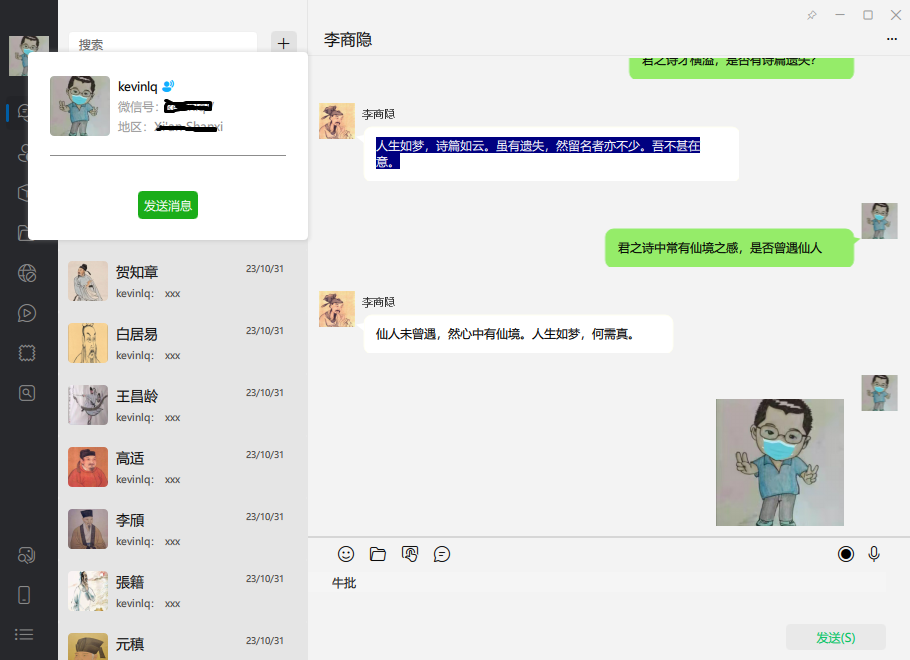
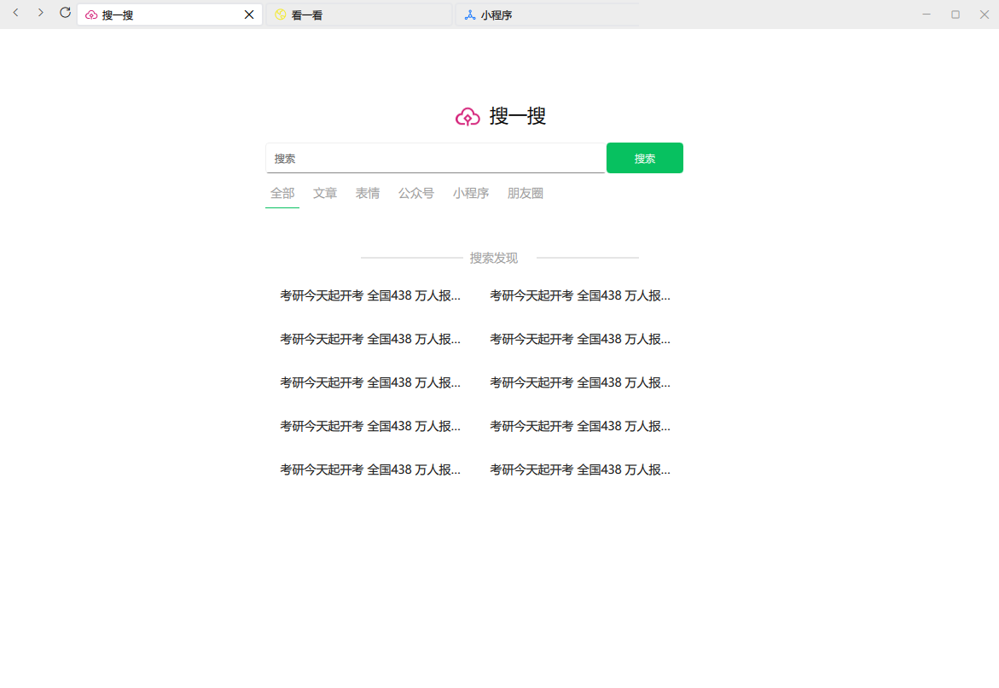

<!-- PROJECT SHIELDS -->
<!--
*** I'm using markdown "reference style" links for readability.
*** Reference links are enclosed in brackets [ ] instead of parentheses ( ).
*** See the bottom of this document for the declaration of the reference variables
*** for contributors-url, forks-url, etc. This is an optional, concise syntax you may use.
*** https://www.markdownguide.org/basic-syntax/#reference-style-links
-->
[![Contributors][contributors-shield]][contributors-url]
[![Forks][forks-shield]][forks-url]
[![Stargazers][stars-shield]][stars-url]
[![Issues][issues-shield]][issues-url]
[![MIT License][license-shield]][license-url]
[![LinkedIn][linkedin-shield]][linkedin-url]


<!-- PROJECT LOGO -->
<br />
<p align="center">
  <a href="https://github.com/kevinlq/KWechatQml">
    
  </a>

  <h3 align="center">KWechatQml</h3>

  <p align="center">
    KWechatQml
    <br />
    <a href="https://github.com/kevinlq/KWechatQml"><strong>Explore the docs »</strong></a>
    <br />
    <br />
    <a href="https://github.com/kevinlq/KWechatQml">View Demo</a>
    ·
    <a href="https://github.com/kevinlq/KWechatQml/issues">Report Bug</a>
    ·
    <a href="https://github.com/kevinlq/KWechatQml/issues">Request Feature</a>
  </p>
</p>

# KWechatQml

[英语/English](README.md)

> `KWechatQml` 是一个使用Qt/QML 模仿微信界面实现的项目，可以帮助你快速了解 QML 如何快速开发界面。

## 使用指南

### 使用

从本项目中，你可以学习到以下知识点:

- 支持动态切换皮肤(内置浅色和深色)
- 支持动态切换语言
- `QML` 如何自定义组件
- `QML` 如何动态创建组件
- `MVC` 如何开发界面
- ……







### 安装

你可以使用以下命令来编译程序:

- 安装 FluentUI 组件
如果你已经安装过，请跳过此步骤
```C++
git clone -b dev --recursive git@github.com:kevinlq/FluentUI.git
```
等待FluentUI组件编译安装成功

- 编译程序
```C++
git clone https://github.com/kevinlq/KWechatQml.git
cd KWechatQml
mkdir build && cd build
cmake ..
make
sudo make install
```

## 文档与贡献

更多关于KWechatQml的信息和用法，请查看README.md文件。如果你有任何问题或建议，欢迎提交issue或pull request。同时，我们也欢迎你为KWechatQml做出贡献！

查看更多关于这个项目的贡献者，请阅读 [contributors](#)


## 致谢

感谢 [FluentUI](#) 开源项目


## 版本历史

* V1.0.0 完成核心界面实现

<!-- MARKDOWN LINKS & IMAGES -->
<!-- https://www.markdownguide.org/basic-syntax/#reference-style-links -->
[contributors-shield]: https://img.shields.io/github/contributors/kevinlq/KWechatQml.svg?style=for-the-badge
[contributors-url]: https://github.com/kevinlq/KWechatQml/graphs/contributors
[forks-shield]: https://img.shields.io/github/forks/kevinlq/KWechatQml.svg?style=for-the-badge
[forks-url]: https://github.com/kevinlq/KWechatQml/network/members
[stars-shield]: https://img.shields.io/github/stars/kevinlq/KWechatQml.svg?style=for-the-badge
[stars-url]: https://github.com/kevinlq/KWechatQml/stargazers
[issues-shield]: https://img.shields.io/github/issues/kevinlq/KWechatQml.svg?style=for-the-badge
[issues-url]: https://github.com/kevinlq/KWechatQml/issues
[license-shield]: https://img.shields.io/github/license/kevinlq/KWechatQml.svg?style=for-the-badge
[license-url]: https://github.com/kevinlq/KWechatQml/blob/master/LICENSE.txt
[linkedin-shield]: https://img.shields.io/badge/-LinkedIn-black.svg?style=for-the-badge&logo=linkedin&colorB=555
[linkedin-url]: https://linkedin.com/in/kevinlq
[FluentUI-url]: https://github.com/zhuzichu520/FluentUI

